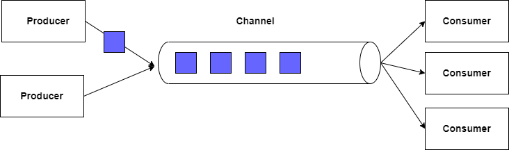

# .NET Core Channels
### This is a demo for using channels in .Net Core 3.1
### [Medium article](https://medium.com/@paulahomsi_50101/net-channels-a21198e7103c)

## Introduction
Before diving into channels, I want to talk about the situation that led me to use them in the first place. So one day at work, we had a problem where we had an API. This API receives a request, does some processing (we’ll call it work1), then does some other processing (required but not related to the actual response returned in the API and we’ll call it work2) and finally returns the response.

What we were trying to do is, since “Work2” is not at all related to the response, we were trying to separate it and to make it happen asynchronously in order to decrease the total response time,

We could of course use a pre-existing queueing system like RabbitMQ for example, build a listener and deploy it and everything should work perfectly, but in our situation, this was a bit over engineering because this won’t be called a lot and we didn’t need all the extra complexity it would add to our system, it was just not worth it.

At the same time we would really get use of cutting the response time in half and cleaning our code by delegating the second job to a different service to handle it.

In our case, a channel was a perfect solution where we were able to finish the second part of processing asynchronously and not complicate our code at all.

## So, What are Channels?
Channel is a concept for passing data between producers and consumers. More specifically, a channel has a queue where multiple producers can write data to it, and then multiple consumers can come and read this data.

Channels use ConcurrentQueue as a data structure in .NET so it can be thread safe and multiple producers/consumers can read/write to it safely.



## Creating Channels
Before start creating a channel in the code, we need to highlight a couple points

A channel has a type, this type act like the topic of this channel, any data of specific type will be written or read from its own channel, and two channels cannot have the same type. There are two types:
### 1. Bounded:
  this type of channels have a finite capacity decided by a parameter, when using bounded channels we need to make sure that the writer will make sure that the channel has enough capacity before attempting to write.

### 2. UnBounded: 
  this type of channels do not have any capacity limit, the only limit here is our server resources of course.
This type can be dangerous if the consumers are slower than the producers, in this case the number of items in the channel will keep increasing and of course this will require more memory, obviously this can cause us to run out of memory at some point, so we need to be careful with the size of our objects and the velocity of the data the producers generates and the performance of our consumers in order to avoid this scenario.

**Now let’s create our channel in a .NET Core application**

In our Startup.cs class we will inject our channel as singleton (obviously because multiple producers and consumers will be using the same instance of the channel)

`services.AddSingleton(Channel.CreateUnbounded<string>());`

Now we can inject our channel in the constructor wherever we want to use them. **Voila!** We created our channel as simple as that!

## Let’s try to Write to a channel
When we create a channel we get a ChannelWriter object which has multiple methods that allow us to write to this channel.

- One simple way to write to a channel is to simply use the WriteAsync method
  `await channel.Writer.WriteAsync("New message");`
  
- Another way is to use TryWriteAsync method, this of course more safe way to write but it still does not consider a boundedChannel capacity

  `bool result = channel.Writer.TryWrite("New message");`
  
- the last two ways might not work in real life scenarios, because you might need to wait until you’re able to write to a channel, or you want to keep trying if the writing is failing for any reason. More optimized way to write to a channel, especially if you are using a bounded channel is to wait until writing is available then try to write

```
while (await _writer.WaitToWriteAsync().ConfigureAwait(false))
{
    while(await _writer.TryWriteAsync(message));
    break;
}
```
  
Now we’re ready to read from the channel.

## Reading from a Channel
Reading from a channel is similar to writing, we get a ChannelReader object when creating the channel, we will use a method called WaitToReadAsync to wait until objects are written in the channel, once there’s something to read we’ll call TryRead trying to read it

```
while (await _reader.WaitToReadAsync())
{
   if (await _reader.TryReadAsync(out var msg))
   {
     Console.WriteLine(msg);
   }
}
```

In real life we might want to put our reading code inside a class that inherit from a BackgroundService to keep the consumer running in the background

 ```
public class ChannelConsumer: BackgroundService
{
   private readonly Channel<string> _channel;
   public ChannelConsumer(Channel<string> channel)
   {
      _channel = channel;
   }
  
   protected override async Task ExecuteAsync(CancellationToken stoppingToken)
   {
      while (!_channel.Reader.Completion.IsCompleted && await _reader.WaitToReadAsync())
      {
         if (_reader.TryRead(out var msg))
         {
            Console.WriteLine(msg);
         }
      }
   }
  
}

```

## Completing A Channel

Completing a channel is basically saying that we're done no one should be able to write/read from this channel anymore. It's like a cancellation token to a Task.

Before completing a channel you need to make sure that not just all writers are done writing but also that all readers are done reading from the channels, because if we attempt to read an element from a closed channel, it'll throw _**ChannelClosedExecption**_ .

One important note to make here is that completing a channel is just a way to notify the readers that the work is completed. So, it doesn't just kill all the readers and stop their work, it only notifies them that after you finish processing the element you've already read, you're done you can't read anymore.

```
channel.Writer.TryComplete();
```

## Summary
Channels are not a very common feature that we read about very commonly, especially in the .NET community, but knowing that the .NET provides us with such a feature opens up a lot of ideas and solutions to problems we already had and either solved them in inefficient or complex ways. It’s a powerful tool that simplifies any producer/consumer pattern and let us think of new ways to solve our problems.

Enjoy Channels ^_^
